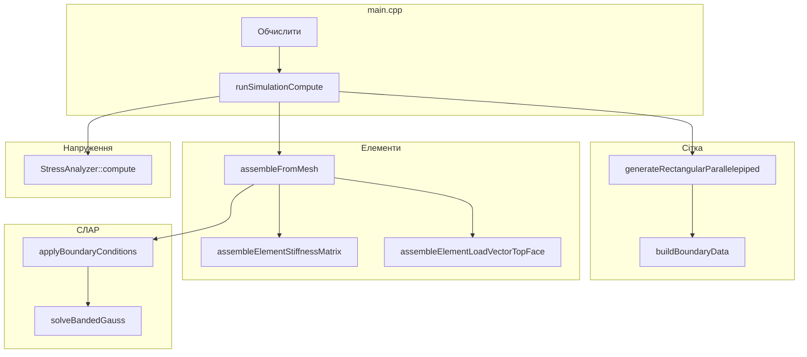
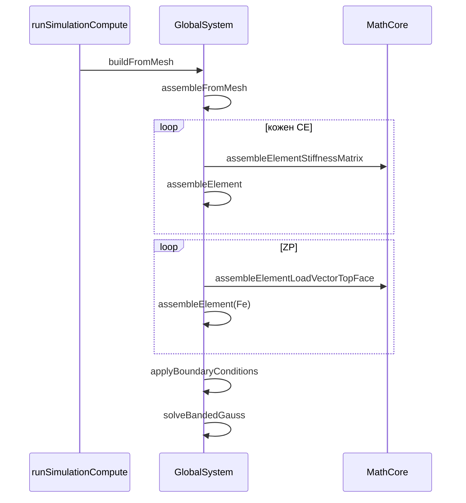
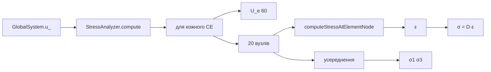

# FEM_Simulator — архітектура та логіка роботи (українською)

Документ описує, як працює програма «під капотом»: модулі, кнопки інтерфейсу, ланцюжки викликів, масиви методички та детальна логіка `MathCore`, `GlobalSystem`, `StressAnalysis`.

---

## Зміст

1. [Що це за програма](#1-що-це-за-програма)
2. [Карта модулів](#2-карта-модулів)
3. [Головний цикл і кнопки UI](#3-головний-цикл-і-кнопки-ui)
4. [Повний ланцюжок «Обчислити»](#4-повний-ланцюжок-обчислити)
5. [MathCore — логіка](#5-mathcore--логіка)
6. [GlobalSystem.cpp — построково](#6-globalsystemcpp--построково)
7. [StressAnalysis.cpp — построково](#7-stressanalysiscpp--построково)
8. [FemValidation](#8-femvalidation)
9. [MeshRenderer (коротко)](#9-meshrenderer-коротко)
10. [Масиви методички](#10-масиви-методички)
11. [Підсумкова схема](#11-підсумкова-схема)

---

## 1. Що це за програма

**Статичний 3D МСЕ-розв’язувач** для пружного ізотропного паралелепіпеда:

- елементи **HEX20 (serendipity)**;
- метод **Гальоркіна**;
- інтегрування **Гауса** (27 точок об’єм, 9 — грань);
- глобальна матриця у **стрічковому форматі MG**;
- крайові умови **методом штрафу**;
- власний **стрічковий Гаус** (без розгортання N×N);
- постпроцесор **σ₁, σ₃**.

**Постановка:**

| Умова | Реалізація |
|-------|------------|
| Тіло | `[0,Lx]×[0,Ly]×[0,Lz]` |
| Низ Y=0 | закріплення Ux=Uy=Uz=0 → **ZU** |
| Верх Y=Ly | тиск P → **ZP** |
| Матеріал | E, ν → **D** |
| Невідомі | U (3 DOF на вузол) |
| Рівняння | **K·U = F** |

OpenGL/ImGui — лише візуалізація; фізика в `MathCore`, `GlobalSystem`, `StressAnalysis`.

---

## 2. Карта модулів

| Модуль | Файли | Роль |
|--------|-------|------|
| **MathCore** | `MathCore.h/cpp` | Сітка, AKT/NT/ZU/ZP, базис, J, D, **K^e**, **F^e** |
| **GlobalSystem** | `GlobalSystem.h/cpp` | **MG**, **F**, штраф ZU, **U** |
| **StressAnalysis** | `StressAnalysis.h/cpp` | ε, σ, σ₁, σ₃ |
| **FemValidation** | `FemValidation.cpp` | Тести зан. 13 |
| **MeshRenderer** | `MeshRenderer.cpp` | OpenGL |
| **main.cpp** | UI, `std::async`, CSV | Кнопки, потоки |

---

## 3. Головний цикл і кнопки UI

### Старт `main`

1. GLFW + OpenGL + ImGui.
2. `rebuildMeshPreview` — попередній перегляд сітки без розв’язку.
3. Кожен кадр: `pollSimulationAsync` → ImGui → `renderer.render` → swap.

Розрахунок у **фоновому потоці** (`std::async`); OpenGL у worker **не** викликається.

### «Оновити сітку (тріангуляція)»

```
drawSettingsWindow → meshPreviewRequested
  → rebuildMeshPreview
      → previewMesh.generateRectangularParallelepiped(...)
      → previewMesh.buildBoundaryData(P)
      → renderer.buildMeshPreview(previewMesh)
  → applyAutoFitCamera
```

**Немає:** `buildFromMesh`, U, напружень.

### «Обчислити (Перерахувати)»

```
runRequested → startSimulationAsync → std::async → runSimulationCompute
```

Після завершення:

```
pollSimulationAsync → ctx = result → applyRendererFromContext → applyAutoFitCamera
```

### «Перевірки методички (зан. 13)»

```
runFemValidationChecks()  // синхронно, еталонні дані
```

### Інше UI

| Дія | Ефект |
|-----|--------|
| Масштаб деформації | `renderer.render(scaleFactor, ...)` |
| Січення X/Z | `renderer.updateIndices` |
| Робочі масиви | AKT, NT, ZU, ZP, MG, F, U |
| CSV | `exportResultsToCsv` після `hasResults` |

---

## 4. Повний ланцюжок «Обчислити»

```
validateParams
resetCalculationProgress
mesh.clear()
mesh.generateRectangularParallelepiped(Lx,Ly,Lz,Nx,Ny,Nz)
mesh.buildBoundaryData(pressure)
material = {E, nu}
system.buildFromMesh(mesh, material, pressure)
    → assembleFromMesh(..., true)
    → applyBoundaryConditions(mesh)
    → solveBandedGauss()
stressAnalyzer.compute(mesh, system, material)
buildValidNodeIds(...)
hasResults = true
```



---

## 5. MathCore — логіка

### 5.1 `Mesh::generateRectangularParallelepiped`

1. Логічна сітка `(2·Nx+1)³`.
2. Для кожного СЕ — 20 вузлів через `kHex20Offsets`, `nodeUsed`.
3. **Compact** — лише вузли, що входять у HEX20.
4. Координати: `X = Lx·ix/(2Nx)` тощо.
5. `buildAKTandNT` → масиви **7**, **21**.

### 5.2 `buildBoundaryData`

- **ZU:** вузли з `|Y| ≤ tol`.
- **ZP:** елементи `ey = Ny-1`, грань η=+1, тиск P.

### 5.3 `computeHalfBandwidth`

`ng = (max(nMax - nMin) + 1) × 3` по всіх СЕ.

### 5.4 Базис HEX20

`evaluateHex20Shape`: 8 кутів (трилінійний serendipity) + 12 ребер (квадратичні).

### 5.5 Гаус

- **3D:** 27 точок, вузли ±√(3/5), 0; ваги 5/9, 8/9, 5/9.
- **2D:** 9 точок для грані; `xi`↔h, `eta`↔t.

### 5.6 Кеші

- **DFIABG (39):** ∂ψ/∂(ξ,η,ζ) у 27 точках, один раз при старті.
- **DPSITE (46):** ψ, ∂ψ/∂h, ∂ψ/∂t на η=+1, 9 точок.

### 5.7 Якобіан і B

- `J_ij = Σ x_k,i · ∂ψ_k/∂ξ_j`, `det(J)` для `w·det(J)`.
- `transformShapeDerivativesToGlobal` — через J⁻¹.
- **B (6×60):** ε = B·U_e.

### 5.8 `assembleElementStiffnessMatrix`

```
K^e = Σ_gp w_gp · det(J) · B^T D B
```

27 точок, симетризація, перевірка det(J)>0.

### 5.9 `assembleElementLoadVectorTopFace`

```
F^e_y += ∫ ψ_i · t_y dS,  t_y = tractionY (зазвичай -P)
```

9 точок, `|∂r/∂h × ∂r/∂t|` як dS.

### 5.10 `verifyUnitCubeJacobianDeterminant`

Куб 4×4×4 м, центр (0,0,0) → det(J) ≈ 8.

---

## 6. GlobalSystem.cpp — построково

**Роль:** глобальна **K·U = F** у стрічці **MG**, штраф **ZU**, **U**.

**Поля:** `dofCount_` (N=3·nqp), `halfBandwidth_` (ng), `kBand_`, `f_`, `u_`.

### 6.1 `gatherElementNodes` (ряд. 18–23)

Копіює 20 координат вузлів СЕ з `mesh.getNodes()` за **NT**.

### 6.2 Прогрес (26–39)

`g_calculationProgress` — atomic для UI; `buildFromMesh` і `solveBandedGauss` оновлюють %.

### 6.3 `allocate` (42–49)

```
kBand_.size = N * ng
f_.size = U_.size = N, нулі
```

Повної N×N матриці **немає**.

### 6.4 Стрічка: `bandIndex`, `getK`, `setK`, `addK`

```
індекс(i,j) = i * ng + (j - i),  j ≥ i, j-i < ng
getK(i,j) — симетрія через getK(j,i) якщо i > j
addK — += для збірки K^e
```

### 6.5 `globalDof` (103–106)

`DOF = nodeId * 3 + component` (0=x, 1=y, 2=z).

### 6.6 `assembleElement` (109–129)

1. Таблиця `globalDofs[60]` з NT.
2. `addF(dof, Fe[i])`.
3. `addK(dof_i, dof_j, Ke[i][j])` для j ≥ i.

### 6.7 Штраф (131–156)

`applyPenaltyToDof`: `K_ii += 1e30`, `F_i = 0` → U_i ≈ 0.

`applyFixedFaceZU`: для кожного вузла з **ZU** — 3 DOF.

### 6.8 `solveBandedGauss` (160–209)

1. `u_ = f_`.
2. **Прямий хід:** для i=0..n-1, зниження рядків k у смузі `i+1..min(i+ng-1,n-1)`.
3. **Зворотний хід:** u[i] = (u[i] - Σ K[i,j]u[j]) / K[i,i].

Прогрес 60–99%. Без розгортання MG у N×N.

### 6.9 `assembleFromMesh` (212–256)

**Фаза 1:** для кожного СЕ — `Ke`, `Fe=0`, `assembleElement`.

**Фаза 2** (якщо `includeSurfaceLoads`): по **ZP** — `Fe = assembleElementLoadVectorTopFace(..., -P)`, `assembleElement` з Ke=0.

### 6.10 `buildFromMesh` (259–272)

```
assembleFromMesh(true) → applyBoundaryConditions → solveBandedGauss
```

Параметр `tractionY` не використовується — P з **ZP**.

### 6.11 `setForceAndSolve` (274–281)

Тест зан. 13: новий F, той самий K, знову Гаус.

### 6.12 Діагностика

- `maxDisplacementY` — max |U_y|.
- `totalReactionForceY` — сума F_y (діагностика).



---

## 7. StressAnalysis.cpp — построково

**Роль:** **U** → σ у вузлах → **σ₁**, **σ₃**.

Напруження в **вузлах** елемента, не в точках Гауса.

### 7.1 `computeStrainFromDerivatives` (11–31)

Сума по 20 вузлах — розкрита **ε = B·U_e**:

| strain | Формула |
|--------|---------|
| εxx | Σ (∂ψ/∂x)·u |
| εyy | Σ (∂ψ/∂y)·v |
| εzz | Σ (∂ψ/∂z)·w |
| γxy | Σ (∂ψ/∂y)·u + (∂ψ/∂x)·v |
| … | … |

### 7.2 `applyHookeLaw` (34–52)

σ = D·ε (та сама D, що в K^e).

### 7.3 `computeMaxPrincipalStress` / `computeMinPrincipalStress` (56–131)

1. Інваріанти I₁, I₂, I₃.
2. Кубічне рівняння (депресована форма).
3. Три корені (тригонометрична формула) → max або min = **σ₁** / **σ₃**.

### 7.4 `computeStressAtElementNode` (134–162)

1. Локальні (ξ,η,ζ) вузла.
2. ∂ψ локально → J → J⁻¹ → ∂ψ глобально.
3. ε → σ.

### 7.5 `StressAnalyzer::compute` (165–234)

**Цикл по СЕ:**

1. Координати 20 вузлів.
2. Зібрати `U_e[60]` з глобального `u_`.
3. Для localNode 0..19: `computeStressAtElementNode` → додати σ до `nodeResults_[globalNode]`, `contributionCount++`.

**Фінал:** σ /= count, σ₁, σ₃, `valid=true`, глобальні max/min.



---

## 8. FemValidation

### Тест 1: det(J)

`verifyUnitCubeJacobianDeterminant()` → ≈ 8 (±0.05).

### Тест 2: розв’язувач

1. Сітка 1×1×1.
2. `assembleFromMesh(..., false)` — без поверхневого F.
3. `applyBoundaryConditions`.
4. `F_i = Σ_j K_ij`.
5. `setForceAndSolve` → очікується **U ≈ 1**, max|U-1| < 1e-9.

---

## 9. MeshRenderer (коротко)

| Метод | Коли |
|-------|------|
| `buildMeshPreview` | «Оновити сітку» — лише геометрія |
| `build` | після розрахунку — U + σ₁ для кольору |
| `render` | `pos = base + U * scaleFactor`, колір від σ₁ |

OpenGL лише в **main thread**.

---

## 10. Масиви методички

| № | Масив | У коді | Коли |
|---|-------|--------|------|
| 7 | AKT | `mesh.getAKT()` | після generate |
| 21 | NT | `mesh.getNT()` | після generate |
| 30 | ZU | `mesh.getZU()` | buildBoundaryData |
| 31 | ZP | `mesh.getZP()` | buildBoundaryData |
| 39 | DFIABG | `GaussShapeDerivativeCache` | старт |
| 46 | DPSITE | `FaceGaussShapeCache` | старт |
| — | MG | `system.stiffnessBand()` | assembleFromMesh |
| — | F | `system.forceVector()` | збірка + штраф |
| — | U | `system.displacements()` | після Гауса |

---

## 11. Підсумкова схема

```
«Обчислити»
  → generate → AKT, NT → ZU, ZP
  → для кожного СЕ: K^e → MG
  → для ZP: F^e → F
  → штраф ZU
  → banded Gauss → U
  → StressAnalyzer → σ1, σ3
  → renderer, таблиця, results.csv
```

### Типові питання

| Питання | Відповідь |
|---------|-----------|
| Де MG? | `GlobalSystem::kBand_` |
| Де F від P? | ZP, `-pressure` у `assembleElementLoadVectorTopFace` |
| Де U? | `u_` після `solveBandedGauss` |
| Чому σ «стрибає» на гранях? | Постпроцесор у вузлах, не в Gauss points |

---

*Документ відповідає коду в `FEM_Simulator/src` (MathCore, GlobalSystem, StressAnalysis, main, FemValidation).*
